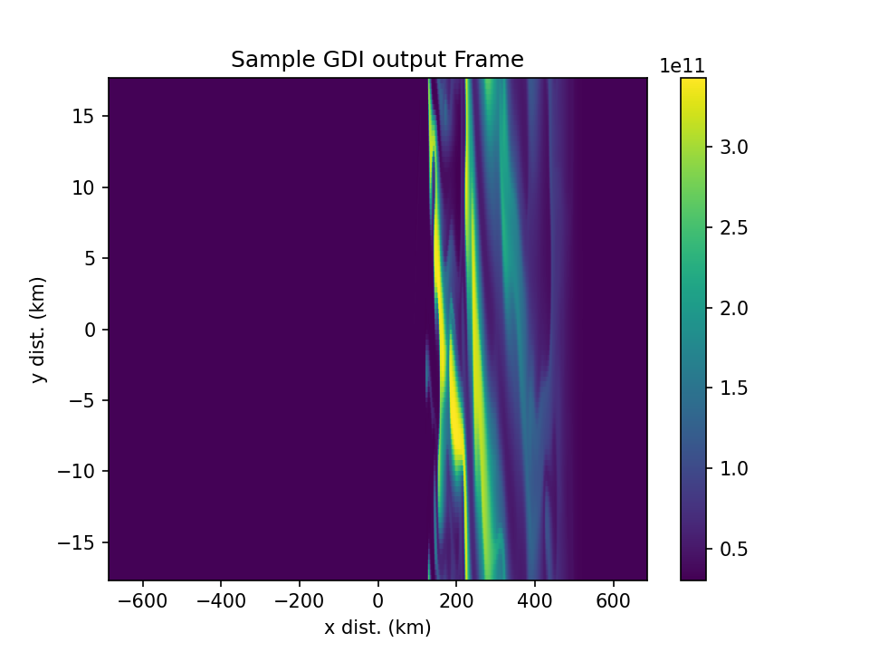

# Gradient-drift Instability Examples for Testing E-region Effects

This example collects together examples for testing how GDI attached to polar cap patches is impacted by a conductive E-region (the E-region shorting phenomena).  The E-region density is controlled by modifying the flat energetic percipitation used throughout all simulations.

This example uses a 3 step process for a GEMINI run:

1. Equilibrum - The "base" ionosphere is configured and the simulation is allowed to run long enough to come to a state of quasi-equilibrium.
2. Staging - The large scale perturbations (patches) are added to the end state of the equilibrium run and the simulation runs several minutes to "settle".  It is not possible to let the simulation in this stage come to a state of true equilibrium because the existance of a large-scale density enhancement is inherently unstable, but you don't want any large transients due to the sudden addition of the patch.
3. Perturbation - The small-scale perturbations (noise) are added on top of the end state of the staging run and an electric field is imposed which drives the actual instability.  This is the only step where GDI is actually active.

## Equilibrium
Example setup for the equlibrium run is provided in the `eq` folder.  Only the config file included is needed.  If you wish to change the E region density, you will have to modify the precipitation characteristics included in this config file and the others used to set up the other steps.  This simulation will need to run for several hours of simulation time, but it can be done at extremely corse spatial resolution.

## Staging
Example setup for the staging run is provided in the `GDI_planar` folder.  This includes both a config file and `perturb_GDI_planar.py`.  The perturbation file is specified in the config file.  To modify the characteristics of the patch (size, location, ect), you will have to modify this python script.  The resolution used for this simulation can be corser than what is used in the final GDI simulation, but it must be fine enough to resolve the patch edge gradients.

## Perturbation
Example setup for the perturbation run is provided in the `perturb` folder.  This includes both a config file and `perturb_add_noise.py`.  The perturbation file is specified in the config file.  Gaussian random noise is added across the simulation space, but the relative amplitude of the noise (usually set around 1%) can be adjusted in the python script.

